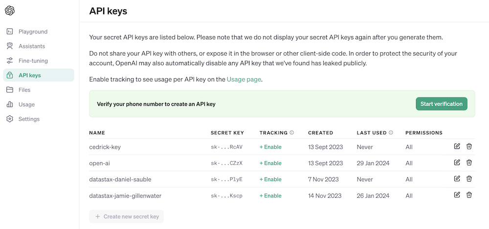
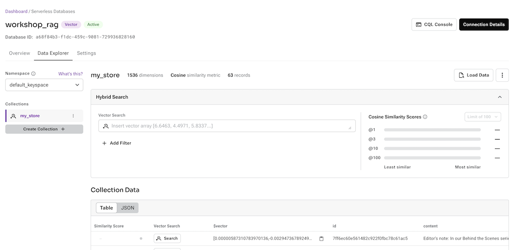

# Welcome to Francine AI


## 1️⃣ Prerequisites

Before start building, you'll gain access to the following by signing up for free:
1. [DataStax Astra DB](https://astra.datastax.com) (you can sign up through your Github account)
2. [OpenAI account](https://platform.openai.com/signup) (you can sign up through your Github account)
3. [Streamlit](https://streamlit.io) to deploy your amazing app (you can sign up through your Github account)

Follow the below steps and provide the **Astra DB API Endpoint**, **Astra DB ApplicationToken** and **OpenAI API Key** when required.

### Sign up for Astra DB
Make sure you have a vector-capable Astra database (get one for free at [astra.datastax.com](https://astra.datastax.com))
- You will be asked to provide the **API Endpoint** which can be found in the right pane underneath *Database details*.
- Ensure you have an **Application Token** for your database which can be created in the right pane underneath *Database details*.


### Sign up for OpenAI
- Create an [OpenAI account](https://platform.openai.com/signup) or [sign in](https://platform.openai.com/login).
- Navigate to the [API key page](https://platform.openai.com/account/api-keys) and create a new **Secret Key**, optionally naming the key.



### Sign up for Streamlit
Follow the steps outlined [here](https://docs.streamlit.io/streamlit-community-cloud/get-started/quickstart).


## 2️⃣ Getting started with Streamlit to build an app

Let us now build a real application we will use the following architecture


In this Francine AI we'll use Streamlit which is an amazingly simple to use framework to create front-end web applications.

To get this application started locally you'll need to install the streamlit dependency as follows:
```bash
pip install streamlit
```

## 3️⃣ Now for the cool part! Let's integrate with the OpenAI Chat Model 🤖

Here we'll integrate the question with a call to the OpenAI Chat Model.

Before we continue, we have to provide the `OPENAI_API_KEY` in `./streamlit/secrets.toml`. There is an example provided in `secrets.toml.example`:

```toml
# OpenAI secrets
OPENAI_API_KEY = "<YOUR-API-KEY>"
```

To get this application started locally you'll need to install several dependencies as follows :
```bash
pip install openai tiktoken astrapy langchain langchain_openai langchain-community
```

## 4️⃣ Combine with the Astra DB Vector Store for additional context

Now things become really interesting! In this step we'll integrate the Astra DB Vector Store in order to provide context in real-time for the Chat Model. Steps taken to implement Retrieval Augmented Generation:
1. User asks a question
2. A semantic similarity search is run on the Astra DB Vector Store
3. The retrieved context is provided to the Prompt for the Chat Model
4. The Chat Model comes back with an answer, taking into account the retrieved context



Before we continue, we have to provide the `ASTRA_API_ENDPOINT` and `ASTRA_TOKEN` in `./streamlit/secrets.toml`. There is an example provided in `secrets.toml.example`:


## 5️⃣ Now let's make magic happen! 🦄

The ultimate goal of course is to add your own company's context to the agent. In order to do this, we'll add an upload box that allows you to upload PDF files which will then be used to provide a meaningfull and contextual response!

To get this application started locally you'll need to install the PyPDF dependency as follows:
```bash
pip install pypdf
```

And run the app:
```bash
streamlit run app.py
```

Now upload a PDF document (the more the merrier) that is relevant to you and start asking questions about it. You'll see that the answers will be relevant, meaningful and contextual! 🥳 See the magic happen!


# Python environments
In case you want to run all of the above locally, it's useful to create a *Virtual Environment*. Use the below to set it up:
```
python3 -m venv myenv
```
Then activate it as follows:
```
source myenv/bin/activate   # on Linux/Mac
myenv\Scripts\activate.bat  # on Windows
```
Now you can start installing packages:
```
pip3 install -r requirements.txt
```
In order to check which packages have been installed:
```
pip3 freeze
```
Which you can save to requirements.txt if you want:
```
pip3 freeze > requirements.txt
```
